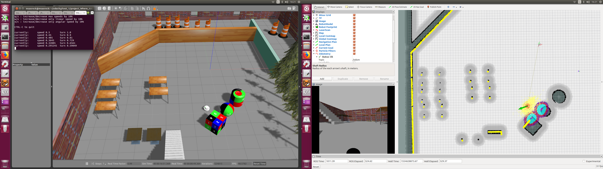
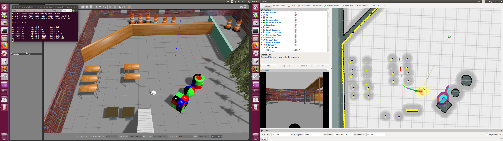
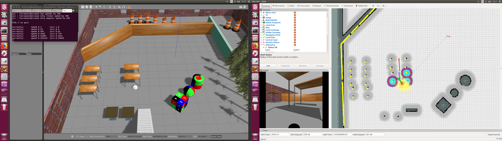
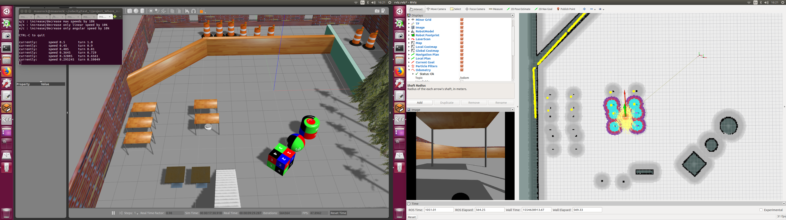

# Where Am I?

## Contents
There are 3 packages:<br>
* **teleop_twist_keyboard** is for manual control of robot motion.
* **my_robot** contains gazebo environemnts for the robot.
* **my_navigation** contains launch files for executing the _map_server_, _amcl_, and _move_base_ nodes. <br>

Note that some example snapshots of the robot simulator can be found inside the folder **results/**.

## Usage<br>
#### Step 1<br>
Open a new terminal, and launch this command to bringup the robot simulator.<br>
```
$ roslaunch my_robot world.launch
```
#### Step 2
Open another new terminal, and launch this command to run the _map_server_, _amcl_, and _move_base_ nodes.
```
$ roslaunch my_navigation amcl.launch
```
#### Step 3
Open another new terminal for manual keyboard control if needed.
```
$ rosrun teleop_twist_keyboard teleop_twist_keyboard.py
```

## Example Snapshots
#### Step 1
The robot uses the laser data to understand about its current position in the map. Also, its estimated orientation is shown as a _green arrow_ in **RVIZ** panel.<br>
<br>
#### Step 2
A subgoal (marked as a _red arrow_ in **RVIZ** panel) which is just around the area under the table was assigned.<br>
<br>
#### Step 3
The robot moves autonomously to the assigned subgoal.<br>
<br>
#### Step 4
The robot stops moving once it reaches the assigned subgoal.<br>
<br>
